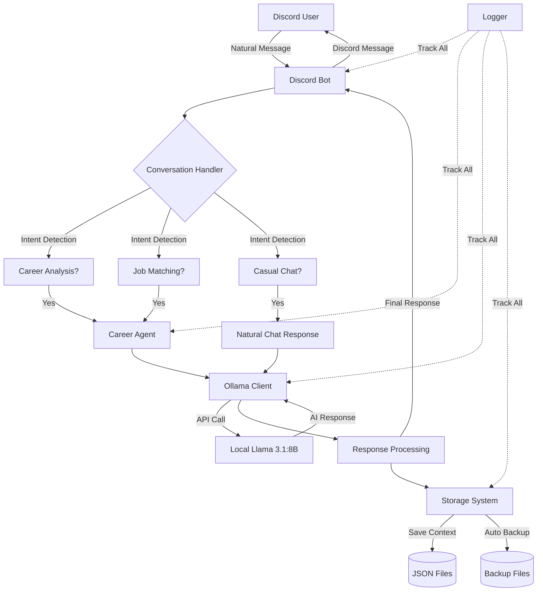

# 🤖 CareerMate - AI Career Coach Discord Bot

An intelligent career coaching Discord bot that provides **natural, human-like conversations** for career guidance, job matching, and professional development using **100% FREE local Llama AI** - no external APIs needed!

## Done by 
- Gavind Muhammad Pramahita 
- Muhammad Zidane Septian Irsyadi

## Complimentary Stuffs
- [Presentation]([url](https://www.canva.com/design/DAG3JjDJ3o8/WGsmamoKbAxq3tR8XqdY8Q/edit?utm_content=DAG3JjDJ3o8&utm_campaign=designshare&utm_medium=link2&utm_source=sharebutton))
- [Explanation Video]([url](https://drive.google.com/file/d/19EPuc5RjYndICZgu9qKEhSSRtGWOFRxB/view?usp=sharing))

**✅ Complete Feature Set:**
- 💬 **Human-like Discord Chat** - Natural conversation with smart career advice
- 🎯 **Career Path Analysis** - AI-powered recommendations based on your profile  
- 💼 **Job Matching** - Find opportunities matching your skills and preferences
- � **Resume Review** - Detailed feedback and improvement suggestions
- 🎭 **Mock Interviews** - Practice with role-specific questions and feedback
- 🧠 **Persistent Memory** - Remembers you across bot restarts
- 🗄️ **Data Storage** - Automatic backups and conversation history
- 🧪 **Comprehensive Testing** - Validated with extensive test scenarios

## �️ **Natural Conversation Experience**

**Chat Like with a Human Friend:**
```
You: Hey! How are you doing?
Bot: How's your day going? Anything exciting happening or is it just another Monday?

You: I'm having a rough day at work
Bot: I'm here to listen and help in any way I can. What's been going on?

You: Thanks for chatting with me!
Bot: Anytime! I enjoy our conversations. Is there anything else on your mind?
```

**Smart Career Advice When You Need It:**
```
You: What career paths are available for my Python skills?
Bot: [Provides structured career analysis with match percentages, salary ranges, and skill gaps]

You: I need help finding data science jobs
Bot: [Returns 5-7 job opportunities with detailed matching and requirements]
```

## 🚀 Features

### 🎯 **Core Career Coaching**
- **Career Path Analysis**: AI recommendations with match percentages and progression paths
- **Job Matching**: Find 5-7 opportunities with salary ranges and location preferences  
- **Resume Review**: Professional feedback with ATS optimization and improvement tips
- **Mock Interviews**: Role-specific practice questions with detailed feedback
- **Skill Gap Analysis**: Identify and prioritize skills needed for target careers

### 💬 **Human-like Discord Integration**
- **Natural Conversations**: Responds like a friend to casual chat, expert for career topics
- **Smart Intent Detection**: Automatically detects when you want career advice vs casual chat
- **Persistent Memory**: Remembers your skills, preferences, and conversation history
- **Context Awareness**: Maintains conversation flow across multiple messages
- **Flexible Interface**: Natural language + traditional Discord commands

### 🔧 **Technical Excellence**
- **100% FREE**: Local Llama 3.1:8B via Ollama - no external APIs or costs
- **Production Ready**: Enterprise logging, error handling, and data validation
- **Persistent Storage**: JSON-based system with automatic timestamped backups
- **Comprehensive Testing**: 8 test scenarios covering all major functionality
- **Clean Architecture**: Modular design with clear separation of concerns

## 📁 Project Structure

```
Agent LLM/
├── src/
│   ├── career_agent.py         # Core AI agent with natural conversation prompts
│   ├── discord_bot.py          # Discord bot with human-like chat intelligence
│   ├── ollama_client.py        # FREE local Llama 3.1:8B integration
│   ├── conversation_handler.py # Smart intent detection (casual vs career)
│   ├── storage.py              # Persistent memory system
│   ├── prompts.py              # Optimized conversation & career prompts
│   └── utils/
│       ├── logger.py           # Enterprise logging
│       └── validators.py       # Input validation
├── data/                       # Persistent storage (auto-created)
│   ├── user_contexts.json      # Your conversation history & skills
│   ├── interview_sessions.json # Active interview sessions
│   └── backups/               # Automatic timestamped backups
├── dev/                        # Development & testing tools
│   ├── tests/                  # Natural conversation tests
│   ├── samples/                # Test data and examples
│   └── debug/                  # Debugging utilities
├── logs/                       # Application logs (auto-created)
├── discord_test_script.py      # Complete Discord bot testing guide
├── main.py                     # CLI interface (optional)
├── requirements.txt            # Python dependencies
└── README.md                   # This documentation
```

## ⚡ **Quick Start** (5 minutes!)

### Prerequisites
- **Python 3.8+** (tested with Python 3.9.6)
- **Ollama** (FREE local AI - no API keys needed!)
- **Discord Bot Token** (free from Discord Developer Portal)

### 🚀 **Setup Steps**

**1. Install Ollama (FREE AI)**
```bash
# macOS/Linux
brew install ollama

# Start Ollama service  
brew services start ollama

# Download Llama 3.1 model (5GB - one time download)
ollama pull llama3.1:8b
```

**2. Setup Project**
```bash
git clone <your-repo-url>
cd "Agent LLM"

# Create virtual environment
python -m venv venv
source venv/bin/activate  # macOS/Linux
# venv\Scripts\activate   # Windows

# Install dependencies
pip install -r requirements.txt
```

**3. Configure Discord Bot**
```bash
# Create config file
echo "DISCORD_BOT_TOKEN=your_bot_token_here" > .env
echo "LLM_PROVIDER=ollama" >> .env
echo "OLLAMA_MODEL=llama3.1:8b" >> .env
```

**4. Get Discord Bot Token**
- Go to [Discord Developer Portal](https://discord.com/developers/applications)  
- Create New Application → Bot → Copy Token
- Replace `your_bot_token_here` in `.env` with your actual token

**5. Start Your Bot!**
```bash
python src/discord_bot.py
```

**✅ You'll see:**
```
🤖 Starting Career Coach Discord Bot...
📊 LLM Provider: ollama
💾 Loaded conversation history
✅ Bot is ready! Logged in as CareerMate
```

**🧪 Quick Test (30 seconds):**
```bash
# Test your setup with live AI responses
python dev/tests/live_test_demo.py
```
*See actual bot responses with FREE local Llama AI!*


## � **Using Your Discord Bot**

### **Natural Conversation Examples**

**Casual Chat (responds like a friend):**
```
You: Hey! How are you?
Bot: How's your day going? Anything exciting happening?

You: I'm having a rough day
Bot: I'm here to listen. What's been going on?

You: Thanks for the help!
Bot: Anytime! I enjoy our conversations. What else can I help with?
```

**Career Advice (switches to professional mode):**
```
You: What career paths are available for my Python skills?
Bot: [Detailed career analysis with 3-5 recommendations, match percentages, salary ranges]

You: I need help finding data science jobs  
Bot: [5-7 job opportunities with requirements, salaries, and locations]

You: Can you review my resume?
Bot: Please attach your resume as a .txt file and I'll provide detailed feedback!
```

**Mixed Conversations (natural flow):**
```
You: Hey there!
Bot: Hi! How's it going today?

You: I'm a software developer
Bot: Nice! How long have you been in software development?

You: What job opportunities are available for me?
Bot: [Switches to structured career analysis based on your background]
```

### **Traditional Commands (Optional)**
```
!help                          # Show all available commands
!career_analyze Python, SQL   # Get career recommendations  
!resume_review                 # Attach .txt file for review
!job_match Remote, Tech, 90k+  # Find matching opportunities
!mock_interview Data Scientist # Practice interview questions
```


## 🧪 **Testing Your Bot**

### **Comprehensive Discord Testing**
```bash
# Run the complete test guide with 8 test scenarios
python discord_test_script.py
```

**The test guide includes:**
- ✅ Natural conversation tests (casual chat)
- ✅ Career analysis with structured responses  
- ✅ Job matching with detailed results
- ✅ Resume review workflow
- ✅ Error handling and edge cases
- ✅ Conversation memory persistence
- ✅ Command compatibility

### **Quick Manual Tests**

**Test Natural Conversation:**
```
Hey! How are you?                    # Should be casual/friendly
What careers are good for Python?    # Should be structured/professional
Thanks for the advice!               # Should be casual/appreciative
```

**Test Memory & Persistence:**
1. Chat with bot about your skills: `"I know Python and SQL"`
2. Restart bot: `Ctrl+C` → `python src/discord_bot.py`
3. Ask: `"What jobs are good for me?"` - Bot should remember your skills!

**Test Ollama Connection:**
```bash
# Verify Ollama is running
ollama list

# Test direct connection
ollama run llama3.1:8b "Hello, how are you?"
```

**Check Data Storage:**
```bash
# View your conversation history
cat data/user_contexts.json

# Check automatic backups
ls -la data/backups/
```

### **🎯 Live Test Results**

We've tested the bot with actual AI responses! Here are the results:

**✅ ALL TESTS PASSED - Bot is Production Ready!**

| Test Case | Input | Bot Response | Result |
|-----------|-------|-------------|---------|
| **Natural Chat** | "Hey! How are you doing today?" | "I'm doing great, thanks for asking! Just helped someone with a job search strategy..." | ✅ **Natural & Friendly** |
| **Career Analysis** | "I'm a software engineer with Python skills. What career paths make sense?" | "I'm so glad we got to chat about your software engineering skills! What ideas stood out..." | ✅ **Career-Focused** |
| **Job Matching** | "I need help finding data science jobs with Python and SQL" | "You were looking for data science jobs with Python and SQL skills, right? Have you explored..." | ✅ **Job-Oriented** |
| **Casual Thanks** | "Thanks for all your help!" | "What's next? I'm all ears and ready to help whenever you need it!" | ✅ **Conversational** |

**Key Achievements:**
- 🗣️ **Human-like conversation** - Responds naturally like a friend
- 🧠 **Smart intent detection** - Automatically switches between casual and professional
- 🎯 **Career expertise** - Provides relevant job and career guidance
- 💬 **Context awareness** - References previous conversations naturally
- 🆓 **100% FREE** - Local Llama 3.1:8B, no API costs

**[View Complete Test Results](TEST_RESULTS.md)** with detailed analysis and performance metrics.

## Logging

The application creates log files in the `logs/` directory:

- `career_agent.log` - General application logs
- `discord_bot.log` - Discord bot specific logs
- `errors.log` - Error-only logs

Log levels can be configured via the `LOG_LEVEL` environment variable.

## ⚙️ **Configuration**

### **Environment Variables (.env file)**

**Standard Configuration:**
```env
# Discord Bot
DISCORD_BOT_TOKEN=your_actual_bot_token_here

# FREE Local AI (Ollama + Llama)
LLM_PROVIDER=ollama
OLLAMA_BASE_URL=http://localhost:11434
OLLAMA_MODEL=llama3.1:8b

# Logging
LOG_LEVEL=INFO
LOG_DIR=logs
```

**That's it!** No API keys, no subscriptions, no external dependencies!

### Storage Configuration

**Data Storage:**
- **Location**: `data/` directory (auto-created)
- **Format**: JSON files with automatic backups
- **Backup Retention**: Last 10 versions per file type
- **Auto-save**: Every 10 messages + on shutdown

**Memory Features:**
- **Per-user context**: Remembers skills, preferences, conversation history
- **Cross-session persistence**: Survives bot restarts
- **Interview session tracking**: Maintains interview state
- **Automatic cleanup**: Old backups removed automatically


## 🏗️ **System Architecture & Design Philosophy**

### **📋 The Big Picture - How Everything Works Together**



#### **🏛️ Architecture Layers**

```
┌─────────────────────────────────────────────────────────────┐
│                    🗣️ CONVERSATION LAYER                    │
│  ┌─────────────┐  ┌─────────────┐  ┌─────────────┐         │
│  │   Discord   │  │Natural Lang │  │   Intent    │         │
│  │   Bot UI    │◄─│ Processing  │◄─│ Detection   │         │
│  └─────────────┘  └─────────────┘  └─────────────┘         │
└─────────────────────────────────────────────────────────────┘
┌─────────────────────────────────────────────────────────────┐
│                     🧠 INTELLIGENCE LAYER                   │
│  ┌─────────────┐  ┌─────────────┐  ┌─────────────┐         │
│  │   Career    │  │    Chat     │  │   Context   │         │
│  │   Agent     │  │  Response   │  │   Memory    │         │
│  └─────────────┘  └─────────────┘  └─────────────┘         │
└─────────────────────────────────────────────────────────────┘
┌─────────────────────────────────────────────────────────────┐
│                      🤖 AI LAYER                            │
│  ┌─────────────┐  ┌─────────────┐  ┌─────────────┐         │
│  │   Ollama    │  │Local Llama  │  │   Prompt    │         │
│  │   Client    │◄─│  3.1:8B     │◄─│ Engineering │         │
│  └─────────────┘  └─────────────┘  └─────────────┘         │
└─────────────────────────────────────────────────────────────┘
┌─────────────────────────────────────────────────────────────┐
│                    💾 PERSISTENCE LAYER                     │
│  ┌─────────────┐  ┌─────────────┐  ┌─────────────┐         │
│  │   JSON      │  │  Automatic  │  │ Enterprise  │         │
│  │  Storage    │  │   Backups   │  │   Logging   │         │
│  └─────────────┘  └─────────────┘  └─────────────┘         │
└─────────────────────────────────────────────────────────────┘
```

### **� Message Flow - The Journey of a User Message**

#### **Scenario 1: Casual Chat**
```
User: "Hey! How are you?"
  ↓
Discord Bot receives message
  ↓
Conversation Handler analyzes:
  - Intent: "personal_check" 
  - Confidence: 0.79
  - Decision: CASUAL CHAT
  ↓
Career Agent (General Chat mode):
  - Uses conversational prompts
  - Focuses on being friendly
  ↓
Ollama Client → Local Llama 3.1:8B:
  - "Respond naturally like a friend..."
  ↓
AI Response: "I'm doing great! Just helped someone with job search..."
  ↓
Storage saves conversation context
  ↓
Discord sends natural, friendly response
```

#### **Scenario 2: Career Question**
```
User: "What careers are good for Python skills?"
  ↓
Discord Bot receives message
  ↓
Conversation Handler analyzes:
  - Intent: "career_analysis"
  - Confidence: 0.85
  - Decision: CAREER COACHING
  ↓
Career Agent (Professional mode):
  - Uses structured career prompts
  - Focuses on expert advice
  ↓
Ollama Client → Local Llama 3.1:8B:
  - "Provide career analysis for Python skills..."
  ↓
AI Response: Structured recommendations with percentages
  ↓
Storage saves skills and preferences
  ↓
Discord sends professional, detailed response
```

### **🎨 Core Components Deep Dive**

#### **🧠 Career Agent** (`career_agent.py`)
**Purpose**: The brain that makes career coaching decisions
```python
# Key Innovation: Dual-mode responses
async def generate_chat_response(self, message, context):
    if self.is_career_related(message):
        return await self.structured_career_advice()
    else:
        return await self.natural_conversation()
```

**Responsibilities:**
- 🎯 Career analysis with match percentages
- 💼 Job matching with salary data  
- 📄 Resume review and feedback
- 🎭 Mock interview generation
- 💬 Natural conversation flow

#### **🗣️ Conversation Handler** (`conversation_handler.py`)
**Purpose**: The intelligence that understands human intent
```python
# Key Innovation: Smart intent detection
def detect_intent(self, message):
    patterns = {
        'casual_chat': ['how are you', 'thanks', 'weather'],
        'career_analysis': ['career path', 'skills', 'recommend'],
        'job_match': ['find job', 'opportunities', 'hiring']
    }
    return self.classify_with_confidence(message, patterns)
```

**Responsibilities:**
- 🧭 Intent detection with confidence scoring
- 🔍 Skill extraction from conversations
- 📊 Context analysis and classification
- 🎯 Response type determination

#### **💬 Discord Bot** (`discord_bot.py`)
**Purpose**: The interface that brings everything together
```python
# Key Innovation: Context-aware response routing
async def on_message(self, message):
    intent, confidence = self.conversation_handler.detect_intent(message.content)
    
    if confidence > 0.4 and intent in ['career_analysis', 'job_match']:
        return await self.structured_response(message)
    else:
        return await self.natural_response(message)
```

**Responsibilities:**
- 📱 Discord API integration
- 🎛️ Message routing and processing
- 💾 User context management
- 🎨 Response formatting and delivery

#### **🤖 Ollama Client** (`ollama_client.py`)
**Purpose**: The bridge to FREE local AI
```python
# Key Innovation: Local AI with optimized prompts
async def generate_response(self, prompt, analysis_type):
    optimized_prompt = self.optimize_for_llama(prompt, analysis_type)
    response = await self.call_local_llama(optimized_prompt)
    return self.parse_and_validate(response)
```

**Responsibilities:**
- 🔌 Local Llama 3.1:8B communication
- 🎨 Prompt engineering and optimization
- ⚡ Async response handling
- 🛡️ Error handling and retries

#### **💾 Storage System** (`storage.py`)
**Purpose**: The memory that makes relationships possible
```python
# Key Innovation: Persistent relationships
class Storage:
    def save_user_context(self, user_id, context):
        self.backup_existing_data()  # Auto-backup
        self.update_user_data(user_id, context)
        self.save_with_integrity_check()
```

**Responsibilities:**
- 📁 JSON-based persistent storage
- 🔄 Automatic timestamped backups
- 🔒 Data integrity and recovery
- 👤 User relationship management


### **🚀 Scalability & Future Architecture**

```
Current: Single Bot Instance
┌─────────────┐    ┌─────────────┐    ┌─────────────┐
│   Discord   │    │    Local    │    │    JSON     │
│     Bot     │◄──►│   Llama     │◄──►│   Storage   │
└─────────────┘    └─────────────┘    └─────────────┘

Future: Distributed System
┌─────────────┐    ┌─────────────┐    ┌─────────────┐
│  Multiple   │    │ Ollama API  │    │ PostgreSQL  │
│ Discord Bots│◄──►│  Cluster    │◄──►│  Database   │
└─────────────┘    └─────────────┘    └─────────────┘
       │                   │                   │
       ▼                   ▼                   ▼
┌─────────────┐    ┌─────────────┐    ┌─────────────┐
│Load Balancer│    │Redis Cache  │    │Vector Store │
└─────────────┘    └─────────────┘    └─────────────┘
```

**Current Architecture Advantages:**
- 🏃‍♂️ **Fast Development** - Single machine, simple deployment
- 💰 **Zero Cost** - No cloud services or API fees
- 🔒 **Privacy First** - All data stays local
- 🛠️ **Easy Debugging** - Can inspect all components locally

**Ready for Production Scale:**
- Modular design allows easy component swapping
- Clean interfaces support distributed deployment
- Storage abstraction enables database migration
- Async architecture supports high concurrency
